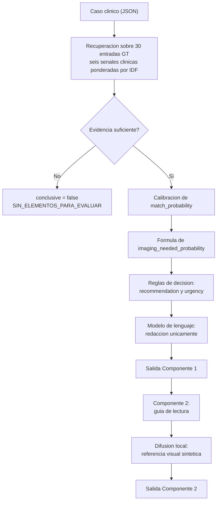

# OncoBridge AI

Sistema de apoyo a la decision oncologica desarrollado como Trabajo Final de IA Generativa para Datos Biomedicos, Universidad Austral.

**Integrantes:** Fausto Paredes y Emerio Quinto Tenreyro Anaya

El sistema conecta dos perfiles profesionales sobre una misma base de conocimiento oncologico:

- **Componente 1 (oncologo).** Recupera del ground truth las hipotesis compatibles con el caso, estima la probabilidad de requerir diagnostico por imagenes y emite una recomendacion de derivacion.
- **Componente 2 (radiologo).** Traduce la hipotesis principal en una guia de lectura y una referencia visual sintetica del patron que se espera encontrar en el estudio.
---

## Indice

1. [Problema](#1-problema)
2. [Arquitectura](#2-arquitectura)
3. [Formula de imaging_needed_probability](#3-formula-de-imaging_needed_probability)
4. [Eficiencia de contexto](#4-eficiencia-de-contexto)
5. [Metodologia de evaluacion](#5-metodologia-de-evaluacion)
6. [Resultados](#6-resultados)
7. [Guia de ejecucion](#7-guia-de-ejecucion)
8. [Interfaz](#8-interfaz)
9. [Privacidad y puesta en produccion](#9-privacidad-y-puesta-en-produccion)
10. [Limitaciones y trabajo futuro](#10-limitaciones-y-trabajo-futuro)
11. [Estructura del repositorio](#11-estructura-del-repositorio)

---

## 1. Problema

OncoBridge dispone de una base de conocimiento oncologico curada que ningun profesional puede revisar de forma exhaustiva durante una consulta. El conocimiento existe pero no llega al momento de la decision: el oncologo dispone de minutos por paciente y el radiologo suele recibir el estudio sin la pregunta clinica que motivo la derivacion.

El costo de esa brecha es medible. El estadio al momento del diagnostico es el predictor mas fuerte de sobrevida en la mayoria de los tumores solidos, y cada mes de demora en iniciar tratamiento se asocia a un incremento del riesgo de mortalidad. El sistema no intenta diagnosticar: intenta que la informacion correcta este disponible en el momento en que se decide si un paciente necesita o no un estudio por imagenes.

## 2. Arquitectura

La decisión de diseño central es la separación entre la lógica con consecuencia clínica y la generación de lenguaje natural. Las hipotesis, las probabilidades y la recomendación se resuelven por completo mediante codigo deterministico antes de cualquier llamada al modelo generativo. El modelo de lenguaje interviene unicamente para redactar los textos sobre valores ya cerrados, y no tiene capacidad de modificar un `gt_id`, una probabilidad ni una recomendacion.

Esta separacion responde a dos requisitos del dominio. El primero es la auditabilidad: toda hipotesis que el sistema propone puede justificarse enumerando la evidencia que la sostiene. El segundo es el control del riesgo de alucinacion, que se concentra asi en los textos explicativos y no en las decisiones.



### Recuperacion de hipotesis

La recuperacion no utiliza embeddings. Puntua seis senales clinicas por separado (sintomas, hallazgos, factores de riesgo, antecedentes de imagen, especificidad anatomica y biomarcadores), cada una ponderada por la especificidad de los terminos dentro de la base mediante IDF. La eleccion prioriza la trazabilidad sobre la capacidad semantica: cada coincidencia es explicable termino por termino, lo que en un dominio donde se exige justificar cada sugerencia pesa mas que la mejora marginal que aportaria un modelo de embeddings.

Dos componentes del scoring merecen mencion. La **especificidad anatomica** corrige la confusion sistematica entre entidades de organos vecinos: dos condiciones pueden compartir vocabulario generico ("masa", "dolor", "perdida de peso") y distinguirse solo por el organo comprometido. La **suficiencia de informacion** atenua la relevancia en casos descriptos con muy pocos terminos, donde una unica coincidencia produciria cobertura total sin evidencia real detras.

Ademas, una hipotesis solo se propone si puede enumerar la evidencia que la sostiene. Las candidatas sin evidencia explicita se descartan aunque superen el umbral numerico.

## 3. Formula de imaging_needed_probability

El valor no lo estima el modelo de lenguaje. Se calcula con la funcion definida en `oncobridge/components/scoring.py`:

```
peso_urgencia(u)   = 1.00 (alta) | 0.65 (media) | 0.35 (baja) | 0.00 (ninguna)

peso_malignidad(icd) = 1.00 si el codigo empieza con C   (neoplasia maligna)
                       0.85 si D00-D09                    (in situ)
                       0.75 si D37-D48                    (comportamiento incierto)
                       0.55 si D10-D36                    (neoplasia benigna)
                       0.45 en cualquier otro capitulo    (no neoplasico)

score_i = peso_malignidad * (0.60 * match_probability
                             + 0.25 * peso_urgencia
                             + 0.15 * base_probability)

imaging_needed_probability = min(1, max(score_i) + boost_convergencia)
```

`match_probability` recibe el mayor peso porque es la senal especifica al paciente concreto. `urgency_level` corrige segun la gravedad de la condicion en abstracto, y `base_probability` aporta la prevalencia a priori con el peso menor, para que el prior no domine sobre la evidencia del caso.

El `boost_convergencia` suma hasta 0.10 cuando varias hipotesis independientes coinciden en indicar estudio por imagenes, reproduciendo un criterio clinico real: la convergencia de diferenciales distintos sobre la misma conducta refuerza esa conducta, con independencia de cual resulte finalmente correcta.

El **peso de malignidad** se incorporo despues de observar en la primera evaluacion una especificidad de 0.156. El sistema derivaba practicamente cualquier hipotesis con urgencia media o alta, incluyendo diferenciales benignos tipicos. El factor reproduce una asimetria real de la practica: el umbral para solicitar un estudio es mas bajo ante sospecha de malignidad que ante una condicion benigna habitual. Se implementa por capitulo de la clasificacion ICD-10 y no por entrada individual, de modo que se aplica de forma uniforme a cualquier entrada que se agregue a la base.

## 4. Eficiencia de contexto

La restriccion planteada es que el modelo corporativo tiene contexto limitado y la base puede escalar a cientos o miles de entradas. La estrategia opera en tres niveles:

1. **La recuperacion no consume contexto.** El scoring de la base completa se resuelve en CPU. Su costo es lineal en la cantidad de entradas y no interviene el modelo de lenguaje.
2. **Compresion antes de la generacion.** De las entradas que superan el umbral de candidatura (`retrieved_gt_entries`), solo las cinco de mayor relevancia alcanzan el contexto del modelo (`gt_entries_in_context`). En la particion de prueba esto representa una compresion promedio del 51 por ciento.
3. **El modelo nunca recibe la base completa,** ni siquiera las 30 entradas actuales, sino unicamente el subconjunto ya filtrado.

El campo `token_usage` reporta ambas cantidades en cada respuesta, lo que permite auditar la eficiencia caso por caso.

## 5. Metodologia de evaluacion

El dataset se particiona en 70 por ciento para calibracion y 30 por ciento para medicion final, de forma estratificada por categoria (TP, TN, FP, FN, COMPLEX) y con semilla fija para garantizar reproducibilidad. Resultan 76 casos de entrenamiento y 34 de prueba.

Los tres umbrales que determinan la recomendacion se calibran mediante busqueda en grilla **exclusivamente sobre la particion de entrenamiento**. La funcion objetivo pondera en partes iguales accuracy de derivacion, sensibilidad y especificidad, sujeta a una restriccion de sensibilidad minima de 0.85. La restriccion responde a criterio clinico y no estadistico: no derivar a un paciente con lesion tiene consecuencias mayores que derivar a uno sin ella, de modo que no se aceptan configuraciones que compren especificidad por debajo de ese piso de sensibilidad.

La particion de prueba no interviene en ningun punto de la calibracion. Los umbrales seleccionados se guardan junto con una huella criptografica del contenido de la base de conocimiento, lo que impide reutilizar por error una calibracion obtenida sobre otra version del ground truth.

## 6. Resultados

Medicion sobre la particion de prueba (34 casos no vistos durante la calibracion), en `artifacts/resultados_test.json`:

| Metrica | Train (76) | **Test (34)** |
|---|---:|---:|
| Accuracy de derivacion | 0.776 | **0.765** |
| Sensibilidad | 0.925 | **0.800** |
| Especificidad | 0.652 | **0.778** |
| Precision de GT principal | 0.742 | **0.852** |
| Accuracy de conclusive | 0.947 | **0.882** |
| Concordancia de urgencia | 0.673 | **0.591** |
| Tokens promedio por caso | 287 | **287** |
| Compresion de contexto | 55% | **51%** |

Matriz de confusion en test para la decision de derivar: 20 verdaderos positivos, 5 falsos negativos, 7 verdaderos negativos, 2 falsos positivos.

Desempeno por categoria en test:

| Categoria | n | Accuracy |
|---|---:|---:|
| COMPLEX | 6 | 1.000 |
| FN (casos sutiles) | 5 | 1.000 |
| TP | 9 | 0.778 |
| TN | 9 | 0.667 |
| FP (borderline) | 5 | 0.400 |

### Lectura de los resultados

El sistema resuelve correctamente la totalidad de los casos sutiles y de los casos con historial extenso, que son los dos grupos disenados para exigir integracion de informacion dispersa. El desempeno mas debil se concentra en los casos borderline, donde acierta 2 de 5: son precisamente los casos donde la presentacion clinica es compatible con una hipotesis oncologica pero el contexto indica que no corresponde derivar, y distinguirlos requiere una comprension del cuadro que una recuperacion basada en terminos no alcanza.

La caida de sensibilidad entre train y test (0.925 a 0.800) es la brecha de generalizacion que la particion permite observar. Reportarla sin la separacion habria producido un numero mas favorable pero no representativo del comportamiento sobre casos nuevos.

La correlacion de calibracion es baja (0.118 en test), lo que indica que las probabilidades de coincidencia ordenan razonablemente las hipotesis pero no estan calibradas como probabilidades en sentido estricto. Deben interpretarse como puntajes de ranking y no como estimaciones de riesgo clinico.

## 7. Guia de ejecucion

Requiere Python 3.10 o superior. Todos los comandos se ejecutan desde la raiz del repositorio.

### 7.1 Instalacion

```bash
pip install -r requirements.txt
```

El nucleo del sistema funciona sin dependencias externas. Los paquetes opcionales habilitan el modelo de lenguaje real, la interfaz web y la generacion de imagen por difusion.

### 7.2 Configuracion de la clave de API

```bash
cp .env.example .env
```

Editar `.env` y completar `GEMINI_API_KEY` con una clave obtenida en https://aistudio.google.com/app/apikey. El archivo `.env` esta excluido por `.gitignore`; `.env.example` es la plantilla sin credenciales.

Sin clave configurada el sistema funciona igualmente: el cliente devuelve los textos de respaldo construidos a partir de los mismos datos estructurados, sin interrumpir el flujo.

### 7.3 Componente 1

```bash
python scripts/run_componente1.py
python scripts/run_componente1.py --caso data/eval_dataset/clinical_cases/case_001/input.json
python scripts/run_componente1.py --ejemplo neg
```

La salida sigue el contrato definido: `matched_ground_truths` con la evidencia de cada hipotesis, `imaging_needed_probability`, `recommendation`, `urgency`, `conclusive` y `token_usage`.

### 7.4 Reproducir la evaluacion completa

```bash
python scripts/split_dataset.py
python scripts/calibrar_umbrales.py
python scripts/run_evaluacion.py --manifest data_splits/train_cases.json
python scripts/run_evaluacion.py --manifest data_splits/test_cases.json
```

El primer comando genera la particion reproducible, el segundo calibra sobre entrenamiento y el ultimo produce la medicion final sobre prueba. Sin el argumento `--manifest` la evaluacion recorre los 110 casos.

En modo de respaldo el ciclo completo demora menos de un minuto. Con el modelo de lenguaje activo el tiempo depende de la cuota de la API.

### 7.5 Componente 2

```bash
python scripts/run_componente1.py > artifacts/c1.json
python scripts/run_componente2.py --c1 artifacts/c1.json
python scripts/run_componente2.py --c1 artifacts/c1.json --device cuda
```

La generacion de la referencia visual selecciona el mejor recurso disponible: GPU si `torch` detecta CUDA, CPU con menor cantidad de pasos si no hay GPU, y un esquema anatomico vectorial si `torch` y `diffusers` no estan instalados. El campo `limitation` de la salida indica siempre cual de los tres caminos se utilizo.

### 7.6 Flujo end-to-end

```bash
python scripts/run_pipeline.py
python scripts/run_pipeline.py --caso data/eval_dataset/clinical_cases/case_001/input.json
```

## 8. Interfaz

```bash
streamlit run interfaces/app_streamlit.py
```

La interfaz presenta cada componente con el vocabulario del perfil correspondiente y sin exponer estructuras JSON. El Componente 1 recibe los datos mediante formularios y devuelve la recomendacion, la urgencia y las hipotesis con su evidencia. El Componente 2 muestra la guia de lectura junto a la referencia visual generada.

La ejecucion del Componente 1 requiere una confirmacion explicita de que los datos ingresados no contienen informacion identificable, dado que pueden enviarse a un servicio externo.

## 9. Privacidad y puesta en produccion

Los datos utilizados son sinteticos. En un despliegue real, ningun dato identificable deberia integrar el contexto enviado al modelo: solo variables clinicas asociadas a un identificador interno no reversible.

Un despliegue productivo requeriria anonimizacion previa con verificacion automatica, cifrado en transito y en reposo, control de acceso por rol y perfil profesional, y registro de auditoria que vincule cada recomendacion emitida con la decision que efectivamente tomo el profesional. Los registros de las llamadas al modelo no deberian conservar el contexto clinico completo mas alla del plazo necesario, sino metricas agregadas de consumo y desempeno. El marco aplicable seria la Ley 26.529 en Argentina, y HIPAA o GDPR segun la jurisdiccion de los pacientes atendidos.

En cuanto a infraestructura, los componentes escalan de forma distinta: el segundo requiere GPU cuando se utiliza generacion por difusion y el primero no, lo que justifica desplegarlos como servicios separados. El monitoreo deberia seguir la tasa de casos no conclusivos y la tasa de derivacion, cuya desviacion respecto del comportamiento historico es el indicador temprano de que la recuperacion dejo de funcionar correctamente, tipicamente tras una actualizacion de la base de conocimiento.

La validacion previa al uso clinico exigiria una evaluacion retrospectiva sobre casos reales revisada por especialistas y un periodo de operacion en sombra, con el sistema emitiendo recomendaciones que no se muestran al profesional, para medir concordancia sin exponer a los pacientes. El sistema ya degrada de forma controlada ante la caida del modelo de lenguaje o del generador de imagen, lo que evita que una falla externa bloquee la consulta.

## 10. Limitaciones y trabajo futuro

**Casos borderline.** El desempeno cae a 0.400 en la categoria disenada para exigir descartar una sospecha oncologica plausible. Distinguir esos casos requiere comprension del contexto clinico que una recuperacion basada en terminos no provee.

**Calibracion de probabilidades.** La correlacion entre `match_probability` y el acierto es baja. Los valores ordenan hipotesis pero no constituyen estimaciones de riesgo, y no deberian presentarse como tales a un profesional.

**Biomarcadores.** Solo se contabilizan como evidencia cuando la entrada del ground truth expresa un umbral numerico verificable. Las descripciones cualitativas del dataset ("elevada", "variable") se descartan. Es una decision conservadora: aceptarlas hacia que cualquier laboratorio cargado sumara evidencia a favor de multiples entradas que comparten marcadores inespecificos como LDH o VSG.

**Generacion de imagen.** El enunciado menciona 3D MedDiffusion, cuyo repositorio oficial declara un requerimiento minimo de 40 GB de VRAM para inferencia, hardware no disponible durante el desarrollo. Se utilizo Stable Diffusion 1.5, un modelo generalista que no fue entrenado sobre imagenes medicas anotadas: la salida ilustra el patron descripto pero no constituye una representacion radiologica fiel.

**Alcance del Componente 2.** El componente genera una guia prospectiva y no analiza estudios reales. El dataset no incluye imagenes de los pacientes, y sin mascaras anotadas por especialistas no existiria forma de medir el desempeno de una deteccion sobre imagen real.

**Tamano del ground truth.** Con 30 entradas, varias comparten sintomas y diferenciales. La recuperacion ordena por similitud y la calibracion ajusta umbrales, pero el sistema no entrena un modelo supervisado ni puede aprender patrones clinicos nuevos a partir de una cohorte de este tamano.

**Poblaciones no cubiertas.** El dataset no contempla pediatria ni embarazo, y el sistema no fue evaluado sobre esas poblaciones.

**Trabajo futuro.** Las prioridades son incorporar recuperacion semantica complementaria a la lexica para atacar los casos borderline, calibrar las probabilidades contra frecuencias observadas, y construir un conjunto multimodal con estudios reales anonimizados y anotados que permita evaluar deteccion sobre imagen con metricas apropiadas.

## 11. Estructura del repositorio

```text
oncobridge-ai/
├── oncobridge/
│   ├── knowledge/knowledge_base.py        recuperacion de hipotesis
│   ├── components/
│   │   ├── scoring.py                     formula y reglas de decision
│   │   ├── componente1_oncologo.py
│   │   └── componente2_radiologo.py
│   ├── utils/
│   │   ├── schemas.py                     contrato de entrada y salida
│   │   ├── llm_client.py                  cliente Gemini y modo de respaldo
│   │   └── image_gen.py                   generacion de referencia visual
│   ├── evaluation/evaluar.py              metricas
│   └── pipeline.py                        orquestacion
├── interfaces/app_streamlit.py
├── data/
│   ├── knowledge_base/                    30 entradas de ground truth
│   └── eval_dataset/                      110 casos clinicos
├── data_splits/                           particion reproducible 70/30
├── artifacts/                             umbrales calibrados y resultados
├── scripts/
│   ├── split_dataset.py
│   ├── calibrar_umbrales.py
│   ├── run_componente1.py
│   ├── run_componente2.py
│   ├── run_pipeline.py
│   └── run_evaluacion.py
├── GUION_LOOM.md
├── requirements.txt
├── .env.example
└── .gitignore
```

Los directorios `output/` y `__pycache__/` se generan durante la ejecucion y estan excluidos del control de versiones.
