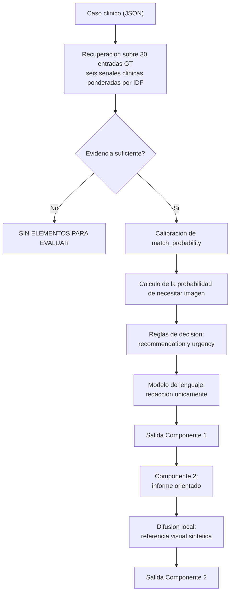

# OncoBridge AI

Sistema de apoyo a la decisión oncológica desarrollado como Trabajo Final de IA Generativa para Datos Biomédicos, Universidad Austral.

**Integrantes:** Fausto Paredes y Emerio Quinto Tenreyro Anaya

El sistema conecta dos perfiles profesionales sobre una misma base de conocimiento oncológico:

- **Componente 1 (oncólogo).** Recupera del ground truth las hipótesis compatibles con el caso, estima la probabilidad de requerir diagnóstico por imágenes y emite una recomendación de derivación.
- **Componente 2 (radiólogo).** A partir de la hipótesis principal arma el informe orientado a la lectura del estudio, con las regiones de interés esperadas y una referencia visual del patrón que debería encontrarse.

Es un prototipo académico sobre datos sintéticos. No está validado para uso clínico ni reemplaza el juicio profesional.

---

## Índice

1. [Problema](#1-problema)
2. [Arquitectura](#2-arquitectura)
3. [Fórmula de imaging_needed_probability](#3-fórmula-de-imaging_needed_probability)
4. [Eficiencia de contexto](#4-eficiencia-de-contexto)
5. [Metodología de evaluación](#5-metodología-de-evaluación)
6. [Resultados](#6-resultados)
7. [Guía de ejecución](#7-guía-de-ejecución)
8. [Interfaz](#8-interfaz)
9. [Componente 2 y el contrato de salida](#9-componente-2-y-el-contrato-de-salida)
10. [Privacidad y puesta en producción](#10-privacidad-y-puesta-en-producción)
11. [Limitaciones y trabajo futuro](#11-limitaciones-y-trabajo-futuro)
12. [Estructura del repositorio](#12-estructura-del-repositorio)

---

## 1. Problema

OncoBridge tiene una base de conocimiento oncológico curada que ningún profesional puede revisar entera durante una consulta. El conocimiento está, pero no llega al momento en que se decide: el oncólogo tiene minutos por paciente, y el radiólogo suele recibir el estudio sin la pregunta clínica que motivó la derivación.

El costo de esa brecha se puede medir. El estadio al momento del diagnóstico es el predictor más fuerte de sobrevida en la mayoría de los tumores sólidos, y cada mes de demora en iniciar tratamiento se asocia a un aumento del riesgo de mortalidad. El sistema no intenta diagnosticar: intenta que la información correcta esté disponible en el momento en que se decide si un paciente necesita o no un estudio por imágenes.

## 2. Arquitectura

La idea principal del diseño es separar dos cosas: por un lado, todo lo que tiene un impacto clínico real, como las hipótesis, las probabilidades y la recomendación final, y por otro lado, la redacción del texto que explica esos resultados. Todo lo que importa clínicamente se calcula primero, con reglas fijas y predecibles, sin que intervenga el modelo de lenguaje. Recién después, cuando esos valores ya están definidos y cerrados, entra el modelo de lenguaje, pero solo para redactar el texto de forma más clara y legible. El modelo no puede cambiar ni inventar un diagnóstico, una probabilidad o una recomendación, porque eso ya viene decidido de antes.

Esto se hace por dos motivos. El primero es poder auditar y confiar en el sistema: cualquier hipótesis que se proponga se puede justificar mostrando la evidencia concreta que la respalda, sin depender de lo que haya "dicho la IA". El segundo es reducir el riesgo de que la IA invente cosas, lo que se conoce como alucinación: como el modelo de lenguaje solo redacta texto explicativo y no toca los números ni las decisiones, si llegara a inventar algo, quedaría limitado a la forma en que se cuenta el resultado, y nunca afectaría el resultado en sí.



### Recuperación de hipótesis

La búsqueda no usa técnicas de inteligencia artificial que "entienden" el significado de las palabras. En cambio, compara seis tipos de información clínica por separado (síntomas, hallazgos, factores de riesgo, estudios de imagen previos, la zona del cuerpo afectada y biomarcadores), y le da más importancia a las palabras que son poco comunes y más específicas, y menos importancia a las palabras genéricas que aparecen en casi todos los casos.

Se eligió este método porque permite explicar exactamente por qué el sistema encontró cada coincidencia, palabra por palabra. En un área donde cada sugerencia tiene que poder justificarse, eso es más importante que ganar un poco más de precisión usando un método de IA más "inteligente" pero menos transparente.

Hay dos detalles que vale la pena aclarar. Primero, tener en cuenta la zona del cuerpo afectada ayuda a no confundir condiciones de órganos vecinos: dos enfermedades distintas pueden compartir palabras comunes como "masa", "dolor" o "pérdida de peso", y la única forma de distinguirlas es fijándose en qué órgano está comprometido. Segundo, cuando un caso está descripto con muy pocas palabras, el sistema baja un poco la confianza en el resultado, porque una sola coincidencia podría hacer parecer que hay más evidencia de la que realmente hay.

Además, una hipótesis solo se propone si puede enumerar la evidencia que la sostiene. Las candidatas sin evidencia explícita se descartan aunque superen el umbral numérico.

## 3. Fórmula de imaging_needed_probability

El valor no lo estima el modelo de lenguaje. Se calcula con la función definida en `oncobridge/components/scoring.py`:

```
peso_urgencia(u)   = 1.00 (alta) | 0.65 (media) | 0.35 (baja) | 0.00 (ninguna)

peso_malignidad(icd) = 1.00 si el codigo empieza con C   (neoplasia maligna)
                       0.85 si D00-D09                    (in situ)
                       0.75 si D37-D48                    (comportamiento incierto)
                       0.55 si D10-D36                    (neoplasia benigna)
                       0.45 en cualquier otro capitulo    (no neoplasico)

score_i = peso_malignidad * (0.60 * match_probability
                             + 0.25 * peso_urgencia
                             + 0.15 * base_probability)

imaging_needed_probability = min(1, max(score_i) + boost_convergencia)
```

`match_probability` recibe el mayor peso porque es la señal específica al paciente concreto. `urgency_level` corrige según la gravedad de la condición en abstracto, y `base_probability` aporta la prevalencia a priori con el peso menor, para que el prior no domine sobre la evidencia del caso.

El `boost_convergencia` suma hasta 0.10 cuando varias hipótesis independientes coinciden en indicar estudio por imágenes. Reproduce un criterio clínico real: cuando distintos diagnósticos diferenciales apuntan a la misma conducta, esa conducta se refuerza, más allá de cuál termine siendo el correcto.

El **peso de malignidad** lo incorporamos después de ver en la primera evaluación una especificidad de 0.156. El sistema derivaba prácticamente cualquier hipótesis con urgencia media o alta, incluyendo diferenciales benignos típicos. El factor refleja una asimetría real de la práctica: el umbral para pedir un estudio es más bajo ante sospecha de malignidad que ante una condición benigna habitual. Se aplica por capítulo de la clasificación ICD-10 y no por entrada individual, así vale igual para cualquier entrada que se agregue a la base.

## 4. Eficiencia de contexto

La restricción es que el modelo corporativo tiene contexto limitado y la base puede crecer a cientos o miles de entradas. La estrategia trabaja en tres niveles:

1. **La recuperación no consume contexto.** El scoring de la base completa se resuelve en CPU. Su costo es lineal en la cantidad de entradas y no interviene el modelo de lenguaje.
2. **Compresión antes de la generación.** De las entradas que superan el umbral de candidatura (`retrieved_gt_entries`), solo las cinco de mayor relevancia llegan al contexto del modelo (`gt_entries_in_context`). En la partición de prueba esto representa una compresión promedio del 51 por ciento.
3. **El modelo nunca recibe la base completa,** ni siquiera las 30 entradas actuales, sino únicamente el subconjunto ya filtrado.

El campo `token_usage` reporta ambas cantidades en cada respuesta, lo que permite auditar la eficiencia caso por caso.

## 5. Metodología de evaluación

El dataset se parte en 70 por ciento para calibración y 30 por ciento para la medición final, de forma estratificada por categoría (TP, TN, FP, FN, COMPLEX) y con semilla fija para que sea reproducible. Quedan 76 casos de entrenamiento y 34 de prueba.

Los tres umbrales que determinan la recomendación se calibran mediante búsqueda en grilla **solo sobre la partición de entrenamiento**. La función objetivo pondera en partes iguales accuracy de derivación, sensibilidad y especificidad, sujeta a una restricción de sensibilidad mínima de 0.85. Esa restricción es clínica y no estadística: no derivar a un paciente con lesión tiene consecuencias mayores que derivar a uno sin ella, así que no se aceptan configuraciones que compren especificidad por debajo de ese piso de sensibilidad.

La partición de prueba no interviene en ningún punto de la calibración. Los umbrales elegidos se guardan junto con una huella criptográfica del contenido de la base de conocimiento, lo que impide reutilizar por error una calibración obtenida sobre otra versión del ground truth.

## 6. Resultados

Medición sobre la partición de prueba (34 casos no vistos durante la calibración), en `artifacts/resultados_test.json`:

| Métrica | Train (76) | **Test (34)** |
|---|---:|---:|
| Accuracy de derivación | 0.776 | **0.765** |
| Sensibilidad | 0.925 | **0.800** |
| Especificidad | 0.652 | **0.778** |
| Precisión de GT principal | 0.742 | **0.852** |
| Accuracy de conclusive | 0.947 | **0.882** |
| Concordancia de urgencia | 0.673 | **0.591** |
| Tokens promedio por caso | 287 | **287** |
| Compresión de contexto | 55% | **51%** |

Matriz de confusión en test para la decisión de derivar: 20 verdaderos positivos, 5 falsos negativos, 7 verdaderos negativos, 2 falsos positivos.

Desempeño por categoría en test:

| Categoría | n | Accuracy |
|---|---:|---:|
| COMPLEX | 6 | 1.000 |
| FN (casos sutiles) | 5 | 1.000 |
| TP | 9 | 0.778 |
| TN | 9 | 0.667 |
| FP (borderline) | 5 | 0.400 |

### Lectura de los resultados

El sistema resuelve bien la totalidad de los casos sutiles y de los casos con historial extenso, que son los dos grupos pensados para exigir integración de información dispersa. Donde flaquea es en los casos borderline, con 2 de 5: son justamente los casos donde la presentación clínica es compatible con una hipótesis oncológica pero el contexto indica que no corresponde derivar, y distinguirlos pide una comprensión del cuadro que una recuperación basada en términos no alcanza.

La caída de sensibilidad entre train y test (0.925 a 0.800) es la brecha de generalización que la partición permite ver. Reportarla sin esa separación habría dado un número más favorable pero no representativo del comportamiento sobre casos nuevos.

La correlación de calibración es baja (0.118 en test), lo que indica que las probabilidades de coincidencia ordenan razonablemente las hipótesis pero no están calibradas como probabilidades en sentido estricto. Hay que interpretarlas como puntajes de ranking y no como estimaciones de riesgo clínico.

## 7. Guía de ejecución

Requiere Python 3.10 o superior. Todos los comandos se ejecutan desde la raíz del repositorio.

### 7.1 Instalación

```bash
pip install -r requirements.txt
```

El núcleo del sistema funciona sin dependencias externas. Los paquetes opcionales habilitan el modelo de lenguaje real, la interfaz web y la generación de imagen por difusión.

### 7.2 Configuración de la clave de API

```bash
cp .env.example .env
```

Editar `.env` y completar `GEMINI_API_KEY` con una clave obtenida en https://aistudio.google.com/app/apikey. El archivo `.env` está excluido por `.gitignore`; `.env.example` es la plantilla sin credenciales.

Sin clave configurada el sistema funciona igual: el cliente devuelve los textos de respaldo construidos a partir de los mismos datos estructurados, sin interrumpir el flujo.

### 7.3 Componente 1

```bash
python scripts/run_componente1.py
python scripts/run_componente1.py --caso data/eval_dataset/clinical_cases/case_001/input.json
python scripts/run_componente1.py --ejemplo neg
```

La salida sigue el contrato: `matched_ground_truths` con la evidencia de cada hipótesis, `imaging_needed_probability`, `recommendation`, `urgency`, `conclusive` y `token_usage`.

### 7.4 Reproducir la evaluación completa

```bash
python scripts/split_dataset.py
python scripts/calibrar_umbrales.py
python scripts/run_evaluacion.py --manifest data_splits/train_cases.json
python scripts/run_evaluacion.py --manifest data_splits/test_cases.json
```

El primer comando genera la partición reproducible, el segundo calibra sobre entrenamiento y el último produce la medición final sobre prueba. Sin el argumento `--manifest` la evaluación recorre los 110 casos.

En modo de respaldo el ciclo completo tarda menos de un minuto. Con el modelo de lenguaje activo el tiempo depende de la cuota de la API.

### 7.5 Componente 2

```bash
python scripts/run_componente1.py > artifacts/c1.json
python scripts/run_componente2.py --c1 artifacts/c1.json
python scripts/run_componente2.py --c1 artifacts/c1.json --imagen studies/estudio.png
python scripts/run_componente2.py --c1 artifacts/c1.json --device cuda
```

Con `--imagen` se le puede pasar un estudio real del paciente; sin ese argumento (el caso del dataset, que no trae imágenes) el informe se arma sobre el patrón esperado de la hipótesis principal. La generación de la referencia visual elige el mejor recurso disponible: GPU si `torch` detecta CUDA, CPU con menos pasos si no hay GPU, y un esquema anatómico vectorial si `torch` y `diffusers` no están instalados. El campo `limitation` de la salida indica siempre cuál de los tres caminos se usó.

### 7.6 Flujo end-to-end

```bash
python scripts/run_pipeline.py
python scripts/run_pipeline.py --caso data/eval_dataset/clinical_cases/case_001/input.json
```

## 8. Interfaz

```bash
streamlit run interfaces/app_streamlit.py
```

La interfaz presenta cada componente con el vocabulario de su perfil y sin exponer estructuras JSON. El Componente 1 recibe los datos con formularios y devuelve la recomendación, la urgencia y las hipótesis con su evidencia. El Componente 2 muestra el informe orientado y la región de interés esperada junto a la referencia visual generada.

Correr el Componente 1 pide una confirmación explícita de que los datos ingresados no contienen información identificable, dado que pueden enviarse a un servicio externo.

## 9. Componente 2 y el contrato de salida

El contrato del sistema (sección 4.3 del enunciado) define que el Componente 2 recibe el output del Componente 1 junto con el estudio de imagen del paciente, y devuelve un informe con `segmentation.regions_of_interest`, `findings`, `classification`, `confidence`, `final_recommendation`, `next_steps` y `token_usage`. La salida del componente respeta esa estructura.

El dataset entregado es exclusivamente clínico y no incluye estudios de imagen de los pacientes, de modo que hay que aclarar cómo se completa cada campo:

- Si el input trae una imagen real (`--imagen` en el script, `image_path` en el JSON), esa imagen es la base del informe. La rama queda implementada para respetar el contrato, aunque el dataset actual no la ejerce.
- Si no hay imagen (el caso del dataset), el informe se arma a partir de la hipótesis principal. En esta situación, `findings` describe el patrón esperado según la entrada de ground truth, no una observación sobre el paciente, y lo dice de forma explícita.

El campo `size_mm` de cada región de interés merece una aclaración, porque el contrato lo pide como número. Ese número solo se puede medir sobre una imagen real. Cuando no hay imagen, el componente toma el tamaño típico esperado que la propia entrada de ground truth documenta para esa lesión (por ejemplo, una masa descripta como "> 4-6 cm" se reporta como 40 mm), y marca la región con `measurement_source: "referencia_ground_truth"` para dejar claro que es un valor de referencia y no una medición del paciente. Si la base no aporta ningún tamaño, el campo queda en `null`. En ningún caso se inventa una medición.

El bloque `generated_radiology_reference` que acompaña a la salida no forma parte del contrato mínimo: lo agregamos como material de trazabilidad, para registrar con qué modelo, dispositivo y prompt se generó la referencia visual, y su limitación.

## 10. Privacidad y puesta en producción

Los datos usados son sintéticos. En un despliegue real, ningún dato identificable debería integrar el contexto que se envía al modelo: solo variables clínicas asociadas a un identificador interno no reversible.

Un despliegue productivo pediría anonimización previa con verificación automática, cifrado en tránsito y en reposo, control de acceso por rol y perfil profesional, y un registro de auditoría que vincule cada recomendación emitida con la decisión que efectivamente tomó el profesional. Los registros de las llamadas al modelo no deberían conservar el contexto clínico completo más allá de lo necesario, sino métricas agregadas de consumo y desempeño. El marco aplicable sería la Ley 26.529 en Argentina, y HIPAA o GDPR según la jurisdicción de los pacientes atendidos.

En cuanto a infraestructura, los componentes escalan distinto: el segundo necesita GPU cuando se usa generación por difusión y el primero no, lo que justifica desplegarlos como servicios separados. El monitoreo debería seguir la tasa de casos no conclusivos y la tasa de derivación, cuya desviación respecto del comportamiento histórico es la señal temprana de que la recuperación dejó de funcionar bien, típicamente después de actualizar la base de conocimiento.

La validación previa al uso clínico exigiría una evaluación retrospectiva sobre casos reales revisada por especialistas y un período de operación en sombra, con el sistema emitiendo recomendaciones que no se le muestran al profesional, para medir concordancia sin exponer a los pacientes. El sistema ya degrada de forma controlada ante la caída del modelo de lenguaje o del generador de imagen, lo que evita que una falla externa bloquee la consulta.

## 11. Limitaciones y trabajo futuro

**Casos borderline.** El desempeño cae a 0.400 en la categoría pensada para exigir descartar una sospecha oncológica plausible. Distinguir esos casos pide una comprensión del contexto clínico que una recuperación basada en términos no provee.

**Calibración de probabilidades.** La correlación entre `match_probability` y el acierto es baja. Los valores ordenan hipótesis pero no son estimaciones de riesgo, y no deberían presentarse como tales a un profesional.

**Biomarcadores.** Solo cuentan como evidencia cuando la entrada del ground truth expresa un umbral numérico verificable. Las descripciones cualitativas del dataset ("elevada", "variable") se descartan. Es una decisión conservadora: aceptarlas hacía que cualquier laboratorio cargado sumara evidencia a favor de varias entradas que comparten marcadores inespecíficos como LDH o VSG.

**Generación de imagen.** El enunciado menciona 3D MedDiffusion, cuyo repositorio oficial declara un mínimo de 40 GB de VRAM para inferencia, hardware que no tuvimos disponible durante el desarrollo. Usamos Stable Diffusion 1.5, un modelo generalista que no fue entrenado sobre imágenes médicas anotadas: la salida ilustra el patrón descripto pero no es una representación radiológica fiel.

**Alcance del Componente 2.** El componente arma un informe orientado a la lectura y, cuando no hay imagen del paciente, trabaja sobre el patrón esperado. El dataset no incluye estudios de los pacientes, y sin máscaras anotadas por especialistas no habría forma de medir el desempeño de una detección sobre imagen real.

**Tamaño del ground truth.** Con 30 entradas, varias comparten síntomas y diferenciales. La recuperación ordena por similitud y la calibración ajusta umbrales, pero el sistema no entrena un modelo supervisado ni puede aprender patrones clínicos nuevos a partir de una cohorte de este tamaño.

**Poblaciones no cubiertas.** El dataset no contempla pediatría ni embarazo, y el sistema no fue evaluado sobre esas poblaciones.

**Trabajo futuro.** Las prioridades son sumar recuperación semántica que complemente a la léxica para atacar los casos borderline, calibrar las probabilidades contra frecuencias observadas, y construir un conjunto multimodal con estudios reales anonimizados y anotados que permita evaluar detección sobre imagen con métricas apropiadas.

## 12. Estructura del repositorio

```text
oncobridge-ai/
├── oncobridge/
│   ├── knowledge/knowledge_base.py        recuperacion de hipotesis
│   ├── components/
│   │   ├── scoring.py                     formula y reglas de decision
│   │   ├── componente1_oncologo.py
│   │   └── componente2_radiologo.py
│   ├── utils/
│   │   ├── schemas.py                     contrato de entrada y salida
│   │   ├── llm_client.py                  cliente Gemini y modo de respaldo
│   │   └── image_gen.py                   generacion de referencia visual
│   ├── evaluation/evaluar.py              metricas
│   └── pipeline.py                        orquestacion
├── interfaces/app_streamlit.py
├── data/
│   ├── knowledge_base/                    30 entradas de ground truth
│   └── eval_dataset/                      110 casos clinicos
├── data_splits/                           particion reproducible 70/30
├── artifacts/                             umbrales calibrados y resultados
├── scripts/
│   ├── split_dataset.py
│   ├── calibrar_umbrales.py
│   ├── run_componente1.py
│   ├── run_componente2.py
│   ├── run_pipeline.py
│   └── run_evaluacion.py
├── GUION_LOOM.md
├── requirements.txt
├── .env.example
└── .gitignore
```

Los directorios `output/` y `__pycache__/` se generan durante la ejecución y están excluidos del control de versiones.
